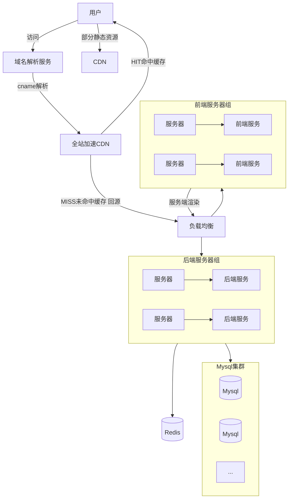

# 网站应用结构图

```mermaid
flowchart TD
    User[用户] -->|访问| DNS[域名解析服务]
    DNS --> |cname解析| DCDN[全站加速CDN]
    DCDN --> |MISS未命中缓存 回源| CLB[负载均衡]
    DCDN --> |HIT命中缓存| User


    subgraph JavaServerGroup[后端服务器组]
    Server1[服务器] --> Java1[后端服务]
    Server2[服务器] --> Java2[后端服务]
    end

    CLB --> JavaServerGroup

    subgraph NodeServerGroup[前端服务器组]
    NodeServer1[服务器] --> NodeJS1[前端服务]
    NodeServer2[服务器] --> NodeJS2[前端服务]
    end

    CLB --> NodeServerGroup

    NodeServerGroup --> |服务端渲染| CLB

    User --> |部分静态资源| CDN

    JavaServerGroup --> Redis[(Redis)]

    subgraph MysqlCluster[Mysql集群]
    Mysql1[(Mysql)]
    Mysql2[(Mysql)]
    ...
    end


    JavaServerGroup --> MysqlCluster
```

> 语法部分参考自:https://mermaid-js.github.io/mermaid/#/flowchart
